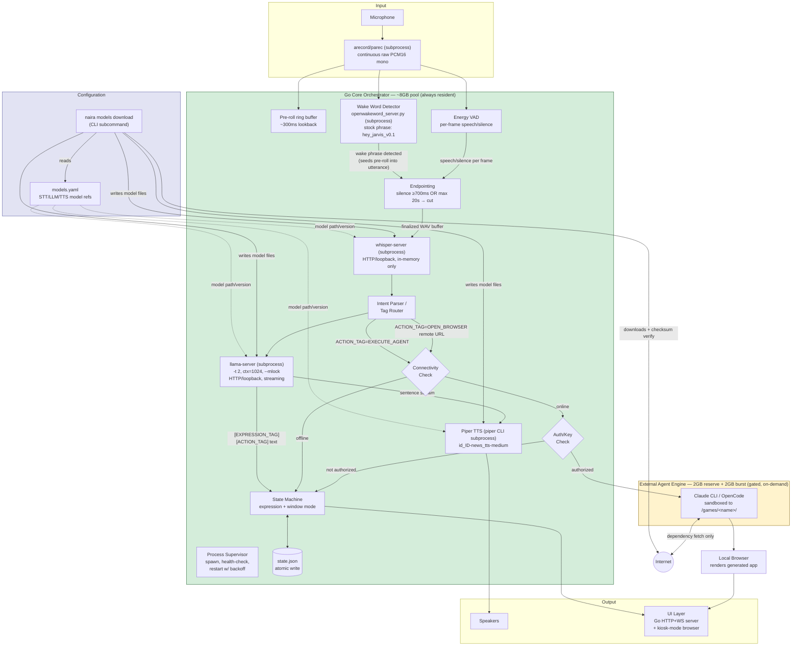
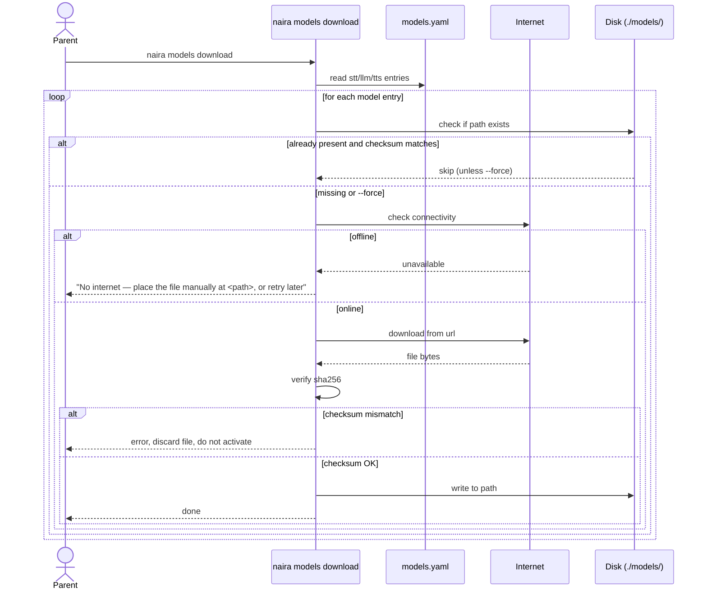
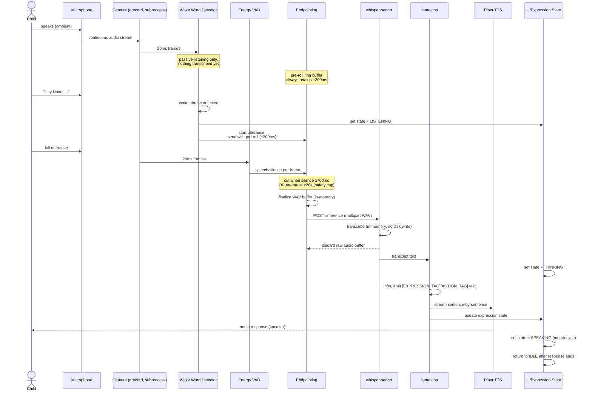
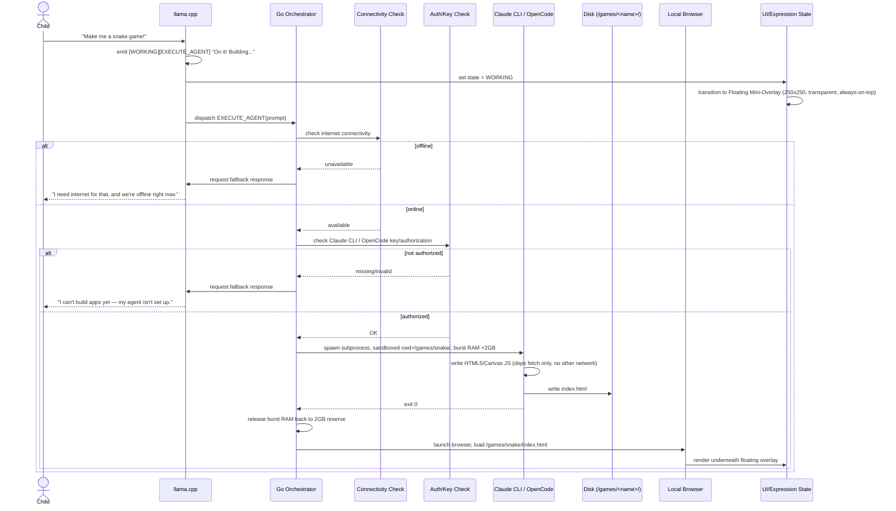
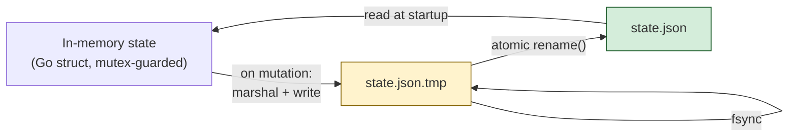
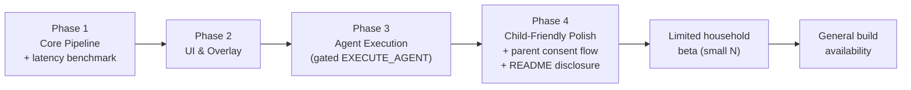

# RFC: Interactive Desktop AI Companion Robot ("Naira")

| Field | Value |
|---|---|
| **Owner** | _TBD — fill with owning team before submission_ |
| **Submitted Date** | 2026-07-25 |
| **Approver** | _TBD — mention relevant tech leads, including infosec approver_ |
| **Related Documents** | [PRD.md](./PRD.md) |
| **Status** | `IDEA` |

> **Instructions (per template convention):** Replace `_TBD_` placeholders with real values. Don't remove sections — mark `N/A` if a section doesn't apply.

---

## Table of Contents

1. [Overview](#1-overview)
   - [Success Criteria](#success-criteria)
   - [Out of Scope](#out-of-scope)
   - [Related Documents](#related-documents)
   - [Assumptions](#assumptions)
   - [Dependencies](#dependencies)
2. [Technical Design](#2-technical-design)
   - [Architecture & Tech Stack](#architecture--tech-stack)
   - [Configuration](#configuration)
   - [Sequence](#sequence)
   - [Local State Storage](#local-state-storage)
   - [APIs](#apis)
3. [High-Availability & Security](#3-high-availability--security)
   - [Performance Requirement](#performance-requirement)
   - [Monitoring & Alerting](#monitoring--alerting)
   - [Logging](#logging)
   - [Security Implications](#security-implications)
4. [Backwards Compatibility and Rollout Plan](#4-backwards-compatibility-and-rollout-plan)
   - [Compatibility](#compatibility)
   - [Rollout Strategy](#rollout-strategy)
5. [Concerns, Questions, or Known Limitations](#5-concerns-questions-or-known-limitations)
6. [Comment Logs](#6-comment-logs)

---

## 1. Overview

Naira is an offline-first, voice-driven AI companion robot built by repurposing a 2nd-gen Intel i5 laptop (i5-2510M, 2 core / 4 thread, upgraded to 12 GB RAM) into a child-facing desktop device. It runs local STT (`whisper.cpp`), local LLM inference (`llama.cpp`), and local TTS (`Piper ONNX`) orchestrated by a Go core process, with an animated facial UI (fullscreen or floating overlay) and an optional, explicitly-gated, internet-dependent skill for generating HTML5 games/apps via Claude CLI / OpenCode.

Core interaction loop, memory constraints, and skill catalog are defined in [PRD.md](./PRD.md); this RFC translates those requirements into an implementable technical design.

### Success Criteria

- Core conversation loop (wake word → STT → LLM → TTS) works **fully offline**, with first-token voice latency `<2.0s` on i5-2510M (target; re-verify empirically under `-t 2`, see [Performance Requirement](#performance-requirement)).
- Zero `Illegal Instruction` crashes from AVX2/FMA/F16C misuse on Sandy Bridge hardware.
- Core runtime (STT+LLM+TTS+Orchestrator+GUI) stays under 7.0 GB RSS; total device RAM (core + agent engine, idle or bursting) never exceeds 12 GB.
- No raw audio is ever persisted to disk or transmitted off-device.
- `EXECUTE_AGENT` (game/app generation) only runs when connectivity **and** Claude CLI/OpenCode authorization are both confirmed; otherwise the robot explains why it can't, out loud, instead of failing silently.
- Parent must explicitly acknowledge a privacy/data-handling disclosure before first use.

### Out of Scope

- Cloud-hosted STT/LLM/TTS fallback (product is offline-first by design; see [PRD §1](./PRD.md#1-executive-summary--objective)).
- Multi-user / multi-child profile support (single-device, single-profile for v1).
- Mobile companion app or remote parental-control dashboard.
- Concurrent execution of multiple `EXECUTE_AGENT` jobs (single job at a time, queued).
- Custom wake-word training UI (ships with a fixed wake word/phrase for v1).
- Hardware assembly / physical enclosure design (software-only RFC).

### Related Documents

- [PRD.md](./PRD.md) — Product Requirement Document (source of truth for feature scope, hardware constraints, skills catalog).

### Assumptions

- Target hardware is confirmed as Intel i5-2510M (2 physical cores / 4 threads via Hyper-Threading), 12 GB RAM, no AVX2/FMA/F16C.
- Device runs a minimal Linux distro (Ubuntu/Debian minimal) with a lightweight WM (`i3wm`/`openbox`), single logged-in session, no multi-tenant OS use.
- Household has intermittent (not guaranteed) internet access — connectivity cannot be assumed available at any given moment.
- Parent/guardian performs initial device setup and can grant a Claude CLI / OpenCode API key/authorization during that setup.
- Child is the primary voice interlocutor; no voice authentication/speaker-ID is required for v1 (any voice can trigger the wake word).

### Dependencies

| Dependency | Purpose | Constraint |
|---|---|---|
| `whisper.cpp` (standalone `whisper-server` binary, subprocess) | STT | Model `base`/`small`, `int8` quant, AVX-only build; spawned + supervised by orchestrator, HTTP on loopback only; identifier/path/port set in `models.yaml`, see [Configuration](#configuration) |
| `llama.cpp` (standalone `llama-server` binary, subprocess) | LLM inference | `-DGGML_AVX=ON -DGGML_AVX2=OFF -DGGML_FMA=OFF -DGGML_F16C=OFF`; spawned + supervised by orchestrator, HTTP streaming on loopback only |
| `arecord`/`parec` (ALSA/PulseAudio CLI, subprocess) | Continuous mic capture → raw PCM16 mono | Spawned once at startup, stdout piped as a continuous frame stream; no CGo audio library needed |
| Energy-based VAD (pure Go, in-process) | Utterance endpointing (speech/silence per frame) | RMS threshold + adaptive noise floor; runs per 20ms frame — too fine-grained for a subprocess call. Upgrade path: WebRTC VAD (small CGo lib) if energy-based proves insufficient in Phase 1 benchmarking |
| Wake-word detector — `openWakeWord` (pure ONNX, no CGo), standalone `scripts/openwakeword_server.py` subprocess | Trigger for LISTENING state | Spawned + supervised like `whisper-server`/`llama-server` (HTTP on loopback only, `internal/adapter/wakeword.HTTPDetector`); ships with a **stock pretrained phrase** (`hey_jarvis_v0.1`, config default `wake_word: "hey jarvis"`) — no custom "Hey Naira" model trained yet, see [§5 Concerns](#5-concerns-questions-or-known-limitations) |
| `Qwen2.5-1.5B-Instruct` or `Llama-3.2-1B-Instruct` (GGUF `Q4_K_M`) | LLM weights | Context capped at 1024 tokens; identifier/path set in `models.yaml`, see [Configuration](#configuration) |
| Piper TTS (`id_ID-news_tts-medium.onnx`) via standalone `piper` CLI subprocess, spawned per sentence | TTS | Verified real voice ID (corrects earlier placeholder `id_ID-indotts-medium`); identifier/path set in `models.yaml`. No CGo — `piper --output-raw` pipes directly into a playback subprocess (`internal/adapter/tts.PiperCLI`, `--tts-player-bin`, default `aplay`), same no-CGo posture as STT/LLM/wake-word; see decision note below |
| Go HTTP+WebSocket server (`internal/adapter/ui`) + static HTML/CSS/JS face client, displayed in a kiosk-mode browser (`chromium --app=...`) | UI rendering | No CGo (avoids `webview`'s native-widget bindings); real OS-level frameless/transparent/always-on-top window control not yet available from a plain browser tab — see [§5 Concerns](#5-concerns-questions-or-known-limitations). Swappable for native `webview`/Neutralinojs later without changing the WS wire format |
| Claude CLI / OpenCode CLI | `EXECUTE_AGENT` skill only | Requires network + valid key/auth; gated, not a hard dependency of core loop |
| Go stdlib `encoding/json` | Local state persistence (flat file, no DB dependency) | See [Local State Storage](#local-state-storage) |
| Linux minimal distro + `i3wm`/`openbox` | OS/WM | No desktop environment overhead |

---

## 2. Technical Design

### Architecture & Tech Stack



**Component notes:**

1. **Orchestration Layer** — Golang, `go build` (no CGo required for STT/LLM/wake-word — see below). Owns state machine, IPC hub, the process supervisor, and all subsystem lifecycles.
2. **Wake Word** — standalone `scripts/openwakeword_server.py` subprocess (openWakeWord, pure ONNX inference, stock pretrained phrase `hey_jarvis_v0.1`), spawned/supervised the same way as STT/LLM and called over HTTP on `127.0.0.1` only (`internal/adapter/wakeword.HTTPDetector`). Gates STT/LLM activation — nothing is transcribed until it fires. Falls back to a never-fires `NoOp` stub if `wakeword.server_bin` is unset in `models.yaml`.
3. **STT** — standalone `whisper-server` binary (from `whisper.cpp`, model `base`/`small`, `int8` quant), spawned as a subprocess by the orchestrator's process supervisor and called over HTTP on `127.0.0.1` only. Only invoked after wake-word detection; raw PCM buffer discarded immediately after transcription (see [Security Implications](#security-implications)). Chosen over CGo bindings for build simplicity and crash isolation — see rationale below.
3. **LLM** — standalone `llama-server` binary (from `llama.cpp`, compiled strictly `GGML_AVX=ON / AVX2=OFF / FMA=OFF / F16C=OFF`), spawned as a subprocess and called over HTTP (streaming) on `127.0.0.1` only. Runtime flags `-t 2` (one thread per physical core — i5-2510M has 2 physical cores, not 4; see [PRD §5](./PRD.md#5-non-functional-requirements--performance-targets)), context capped 1024 tokens, `--mlock` enabled — all passed as subprocess args from `models.yaml`.
4. **TTS** — standalone `piper` CLI binary (from `piper-tts`), spawned fresh per sentence (not a supervised long-lived server — Piper ships no HTTP server mode) via `internal/adapter/tts.PiperCLI`, piping `--output-raw` PCM directly into a playback subprocess (`--tts-player-bin`, default `aplay`) without buffering the whole utterance, preserving the sentence-by-sentence streaming design's latency win. Falls back to `StubTTS` (logs instead of speaking) if `tts.server_bin` is unset in `models.yaml`.
5. **UI** — `internal/adapter/ui.Server`: a Go HTTP server (loopback-only, `--ui-port`) that serves a static HTML/CSS/JS face client (`internal/adapter/ui/static`) and broadcasts `state_change`/`mouth_amplitude`/`window_mode`/`agent_status` over WebSocket (RFC.md#apis Internal IPC); the last `state_change`/`window_mode` frame is cached and replayed to newly-connected clients so a browser reload doesn't get stuck on the splash. Rendered today by launching a browser in kiosk mode (`--ui-browser-bin`, default `chromium --app=<url>`); real drawn sprite frames (`assets/faces/`, 800x480 full-screen art) drive 4 of the 9 expression states (IDLE/LISTENING/THINKING/SPEAKING — SPEAKING's frame picked from live `mouth_amplitude`, not a timer), the rest fall back to a CSS-drawn face. This gets a working expressive face without CGo, but a plain browser tab can't do real OS-level frameless/transparent/always-on-top window control — `window_mode` currently only resizes/repositions the face *within* the page (see [§5 Concerns](#5-concerns-questions-or-known-limitations)). Swappable for native `webview` (CGo) or Neutralinojs later without changing the WS wire format.
6. **Agent Engine** — Claude CLI / OpenCode, invoked as a subprocess only for `EXECUTE_AGENT`, gated by connectivity + auth checks, sandboxed to its own output directory, memory-bursted (2GB→4GB) only while active.
7. **Configuration Layer** — `models.yaml` holds STT/LLM/TTS model identifiers and file paths; a `naira models download` CLI subcommand can fetch them automatically, or a parent can place model files manually at the configured path. See [Configuration](#configuration).
8. **Process Supervisor** — spawns `whisper-server`/`llama-server` as long-lived subprocesses at orchestrator startup, polls until each is accepting connections on its loopback port before marking it ready, and watches for unexpected exit (auto-restart with backoff; see [Monitoring & Alerting](#monitoring--alerting)).

> **CGo vs. standalone subprocess (decision):** STT/LLM/wake-word run as standalone `whisper-server`/`llama-server`/`openwakeword_server.py` processes supervised as long-lived servers, not linked in via CGo. Rationale: (a) crash isolation — a segfault in the C++ inference engine kills its own process, which the supervisor restarts, rather than taking down the whole orchestrator; (b) simpler Go build — no CGo toolchain/cross-compile complexity tied to the exact AVX build flags; (c) STT/LLM already support HTTP with token/segment streaming out of the box, so the sentence-by-sentence streaming design ([Sequence](#sequence)) is preserved. Cost accepted: a small localhost HTTP round-trip per call instead of an in-process function call — negligible next to STT/LLM inference time itself; for wake-word this means one HTTP round-trip per 20ms frame while idle-listening, unbenchmarked on real hardware (see [§5 Concerns](#5-concerns-questions-or-known-limitations)). All three servers **must bind `127.0.0.1` only**, never `0.0.0.0` (see [Security Implications](#security-implications)).
>
> **TTS follows the same no-CGo posture, but not the same shape:** Piper ships no server mode at all, so it can't reuse the supervised-server pattern. Instead `piper` is spawned fresh per sentence and its `--output-raw` stdout is piped directly into a playback subprocess (`aplay` by default) — CLI-per-utterance rather than ONNX Runtime CGo. Rationale: consistency with the no-CGo choice made for STT/LLM/wake-word, at the cost of a process-spawn per sentence instead of an in-process call; revisit if that spawn latency proves too costly against the `<2.0s` budget (see [Performance Requirement](#performance-requirement)).
>
> **UI (decision):** rather than `webview` (CGo, native OS widget bindings) or standing up a separate Neutralinojs binary, the face is a Go-served static HTML/CSS/JS client talking over WebSocket (`internal/adapter/ui`), displayed by launching an existing browser (`chromium --app=<url>`) already present on the target OS. Rationale: zero new binary/CGo dependency, reuses a browser install the device likely already needs for `EXECUTE_AGENT`'s generated-app rendering, and keeps the orchestrator↔UI contract exactly the WebSocket JSON shape specified in [Internal IPC](#apis) — so a real `webview`/Neutralinojs shell can replace the browser later with no server-side change. Cost accepted: a plain browser tab can't do real frameless/transparent/always-on-top window management, so `window_mode` is currently simulated inside the page rather than moving an actual OS window (see [§5 Concerns](#5-concerns-questions-or-known-limitations)).

### Configuration

Two tiers of configuration, split by *what* changes and *why*:

| Tier | Storage | Contents | Why separate |
|---|---|---|---|
| **Model config** | `models.yaml` (flat file, shipped next to the binary, e.g. `~/.naira/models.yaml`) | STT/LLM/TTS model identifiers, file paths, download URLs, checksums | Large binary artifacts (GGUF/ONNX files) don't belong in a DB row; a YAML file is human-editable, diffable, and easy for an advanced parent to hand-edit or point at a different model build |
| **Everything else** | `config` object inside `state.json` (flat file, see [Local State Storage](#local-state-storage)) | Wake word phrase, TTS voice selection *within* the configured model, screen-time thresholds, thread overrides | Runtime/behavioral settings that change via app UI/voice, not by editing a file |

#### `models.yaml` schema

```yaml
stt:
  engine: whisper.cpp
  model: base          # base | small
  quant: int8
  path: ./models/ggml-base-int8.bin
  url: https://huggingface.co/ggerganov/whisper.cpp/resolve/main/ggml-base-int8.bin
  sha256: <checksum>
  server_bin: /usr/local/bin/whisper-server   # standalone subprocess binary, supervised by orchestrator
  port: 8081                                  # loopback-only HTTP
  args: []                                    # extra flags appended after -m <path> --port <port> --host 127.0.0.1

llm:
  engine: llama.cpp
  model: Qwen2.5-1.5B-Instruct
  quant: Q4_K_M
  path: ./models/Qwen2.5-1.5B-Instruct-Q4_K_M.gguf
  url: https://huggingface.co/Qwen/Qwen2.5-1.5B-Instruct-GGUF/resolve/main/Qwen2.5-1.5B-Instruct-Q4_K_M.gguf
  sha256: <checksum>
  server_bin: /usr/local/bin/llama-server     # standalone subprocess binary, supervised by orchestrator
  port: 8080                                  # loopback-only HTTP, streaming
  args: ["-t", "2", "-c", "1024", "--mlock"]  # AVX-safe thread/context/mlock flags (PRD §5)

tts:
  engine: piper
  voice: id_ID-news_tts-medium
  path: ./models/id_ID-news_tts-medium.onnx
  config_path: ./models/id_ID-news_tts-medium.onnx.json
  url: https://huggingface.co/rhasspy/piper-voices/resolve/main/id/id_ID/news_tts/medium/id_ID-news_tts-medium.onnx
  sha256: <checksum>
  server_bin: /usr/local/bin/piper  # piper CLI binary, spawned fresh per sentence (not a supervised server — see decision note above)
  args: []                          # extra flags appended after --model <path> --config <config_path> --output-raw

wakeword:
  engine: openwakeword
  model: hey_jarvis_v0.1        # stock pretrained phrase — no custom "hey naira" model trained yet
  path: ./models/openwakeword   # cache dir; openwakeword's own downloader fetches its onnx files here, NOT via `naira models download`
  server_bin: /usr/bin/python3  # interpreter running scripts/openwakeword_server.py, supervised subprocess
  port: 8082                    # loopback-only HTTP
  args: ["scripts/openwakeword_server.py", "--model", "hey_jarvis_v0.1", "--cache-dir", "./models/openwakeword", "--threshold", "0.5"]
```

- Orchestrator reads `models.yaml` at startup; if a `path` doesn't exist on disk, it refuses to spawn that subsystem's server subprocess and surfaces a clear error (voice + log) rather than letting `whisper-server`/`llama-server` fail on a missing-model-file argument.
- `url` + `sha256` are optional but required for the `models download` subcommand to work — a manually-supplied model (no matching `url`) is still valid, it just can't be auto-fetched or integrity-checked.
- `server_bin`/`port`/`args` (STT/LLM only) configure the standalone subprocess: binary path, loopback port to bind, and extra CLI flags. If `server_bin` is empty, the orchestrator logs a startup error for that subsystem instead of silently running without STT/LLM.

#### Model download subcommand

Manual placement remains supported (parent copies a file to the `path` in `models.yaml`), but the CLI also ships a subcommand to automate it:

```
naira models download [--only stt|llm|tts] [--force]
naira models list          # shows configured vs. present-on-disk status
```



This download step is the **one point in the product's lifecycle where internet access is effectively required** (first-time setup) — consistent with the offline-first principle: once models are on disk, the core conversation loop never needs the network again.

### Sequence

#### Core Conversation Flow (offline, wake-word gated)



#### `EXECUTE_AGENT` Game Generation Flow (gated, online-only)



### Local State Storage

No database engine — a single flat JSON file, `~/.naira/state.json`, read into memory at startup and written back on mutation. Chosen over SQLite for this workload: single device, single writer process, low write volume (session/skill/screen-time events, not high-frequency), no relational queries beyond "sum minutes for a date" (cheap in-memory). Avoids an extra dependency and gives a file a parent could inspect/edit directly if needed. Kept **separate** from `models.yaml` (model identifiers/paths, see [Configuration](#configuration)) — this file holds runtime state and behavioral config, not model selection.



**Write safety:** every mutation is written to a temp file, `fsync`'d, then `rename()`'d over the real file — `rename` is atomic on POSIX filesystems, so a crash/power-loss mid-write leaves the last-good `state.json` intact rather than a half-written corrupt file. This replaces the transactional-safety argument for SQLite without needing a DB engine.

#### `state.json` schema

```json
{
  "schema_version": 1,
  "parent_consent": {
    "disclosure_version": "1.0",
    "accepted_at": "2026-07-25T10:00:00Z",
    "device_id": "..."
  },
  "config": {
    "wake_word": "hey jarvis",
    "tts_voice": "id_ID-news_tts-medium",
    "thread_override": null,
    "screen_time_threshold_minutes": 60
  },
  "sessions": [
    { "id": "uuid", "started_at": "...", "ended_at": "...", "wake_count": 5 }
  ],
  "screen_time_log": [
    { "session_id": "uuid", "date": "2026-07-25", "active_minutes": 30 }
  ],
  "skill_usage": [
    { "session_id": "uuid", "skill_name": "storyteller", "invoked_at": "..." }
  ],
  "generated_apps": [
    { "id": "uuid", "name": "snake", "app_type": "game", "fs_path": "/games/snake/index.html", "prompt_text": "...", "created_at": "..." }
  ]
}
```

**Field notes:**

- `parent_consent` — gates first-run; app refuses to leave setup mode until this key is populated (see [Rollout Strategy](#rollout-strategy) and [Security Implications](#security-implications)).
- `config` — wake word, TTS voice selection, thread overrides, screen-time thresholds. **Does not store model identifiers/paths** — those live in `models.yaml`. No secrets stored here (see key storage note under Security Implications).
- `sessions` / `screen_time_log` — powers the `[SLEEPY]` screen-time-limit behavior ([PRD §4.3 Skill 5](./PRD.md#-skill-5-routine--emotional-companion)).
- `skill_usage` — usage analytics for the 5 companion skills, local-only, never transmitted.
- `generated_apps` — registry of what `EXECUTE_AGENT` has built, so the robot can reopen ("show me the snake game again") without regenerating. Stores `prompt_text` for reproducibility, **never** stores audio.
- **No field stores raw or transcribed audio** — transcripts live in-process only, discarded after the LLM turn completes.
- **Unbounded growth guard:** `sessions`, `screen_time_log`, and `skill_usage` are append-only logs on a long-running device. Orchestrator prunes entries older than a fixed retention window (e.g. 90 days) on load, so `state.json` doesn't grow indefinitely. `generated_apps` is naturally small (bounded by disk space for `/games/`) and isn't pruned automatically.
- `schema_version` — bumped whenever the JSON shape changes; orchestrator runs a one-time in-memory migration on load if the file's version is older than current, then rewrites it.

### APIs

Three API surfaces: (1) an internal IPC contract between the Go orchestrator and the UI layer, (2) an external subprocess contract for invoking Claude CLI/OpenCode, and (3) the operator-facing CLI for model management.

#### Internal IPC (Orchestrator ↔ UI, local WebSocket, JSON)

| Message Type | Direction | Payload | Purpose |
|---|---|---|---|
| `state_change` | Orchestrator → UI | `{ "state": "IDLE\|LISTENING\|THINKING\|SPEAKING\|HAPPY\|SURPRISED\|SYMPATHETIC\|WORKING\|SLEEPY" }` | Drives facial expression |
| `mouth_amplitude` | Orchestrator → UI | `{ "amplitude": 0.0-1.0, "ts": <ms> }` | Mouth-sync during `SPEAKING` |
| `window_mode` | Orchestrator → UI | `{ "mode": "FULLSCREEN\|FLOATING", "w": 250, "h": 250 }` | Adaptive window mode ([PRD §4.1](./PRD.md#41-dynamic-expression-display--window-overlay)) |
| `agent_status` | Orchestrator → UI | `{ "status": "DISPATCHED\|OFFLINE_BLOCKED\|UNAUTHORIZED\|DONE\|FAILED", "job_id": "<uuid>" }` | Reflects `EXECUTE_AGENT` lifecycle to UI |
| `speak_chunk` | Orchestrator → UI | `{ "text": "<sentence>", "seq": <int> }` | Subtitle/caption display alongside TTS — implemented (`internal/adapter/ui.Server.SpeakChunk`, `internal/usecase/conversation.Service`), not cached for replay (see broadcast's cacheSlot note) since a caption is only meaningful in the moment it's spoken |

**Audio cues (addition, not in original spec):** `domain.SoundBoard` (`internal/adapter/sound.Board`) plays a random pre-recorded `.wav` clip — greeting once at startup, an ack chime when an utterance is handed to the LLM, a looping thinking-hum until the LLM's first sentence streams out — from `assets/sounds/{greeting,ack,thinking}_sounds/`, embedded and piped into `aplay` (`--sound-player-bin`) via stdin, no CGo/temp files. Distinct from TTS (fixed clips vs. synthesized speech) and from the WebSocket IPC above (plays locally, nothing pushed to the UI layer for it). Ported from the reference project this design is inspired by ([brenpoly/be-more-agent](https://github.com/brenpoly/be-more-agent)), whose `assets/faces`/`assets/sounds` this repo's UI/audio assets originate from. Best-effort: a missing clip or playback failure is logged and swallowed, never blocks the conversation turn.

**LLM output contract** (parsed by the Intent Parser / Tag Router, [PRD §4.2](./PRD.md#42-system-prompt-tag-routing-micro-agent-pattern)):

```
[EXPRESSION_TAG] [ACTION_TAG] Spoken response string
```

- `EXPRESSION_TAG` ∈ `{IDLE, LISTENING, THINKING, SPEAKING, HAPPY, SURPRISED, SYMPATHETIC, WORKING, SLEEPY}`
- `ACTION_TAG` ∈ `{NONE, EXECUTE_AGENT, OPEN_BROWSER}`
- Parser must reject/re-prompt on malformed output (missing tags, unknown enum value) rather than passing through to TTS unfiltered.

#### External Subprocess Contract (Orchestrator → Claude CLI / OpenCode)

| Aspect | Contract |
|---|---|
| Invocation | `orchestrator` spawns CLI as subprocess with working directory pinned to `/games/<sanitized-name>/` |
| Input | Single prompt string (child's request, LLM-normalized), no audio, no PII |
| Network policy | Dependency-fetch only (npm registry, declared CDN assets) — no other outbound calls permitted from generated code's runtime context |
| Filesystem policy | Write access restricted to its own `/games/<name>/` subdirectory only |
| Timeout | Must define a hard timeout (e.g. 120s) with `[FAILED]` fallback response if exceeded — **open question**, see [§5](#5-concerns-questions-or-known-limitations) |
| Output | Exit code + generated files on disk; orchestrator verifies `index.html` exists before launching browser |
| Auth | Reads key from OS keyring / restricted-permission local config — never hardcoded, never logged |

#### Model Management CLI (Parent-facing, `naira models ...`)

| Command | Effect |
|---|---|
| `naira models download [--only stt\|llm\|tts] [--force]` | Fetches missing/mismatched models per `models.yaml`, verifies `sha256`, writes to configured `path`. Skips already-present, checksum-valid files unless `--force`. |
| `naira models list` | Prints configured vs. present-on-disk status per subsystem (no download side effects). |

Full contract and flow: see [Configuration](#configuration).

---

## 3. High-Availability & Security

_Note: "High-Availability" in the traditional server sense is N/A — this is a single-device, non-networked-service product. This section is reinterpreted as **device reliability & safety**._

### Performance Requirement

| Metric | Target | Mitigation |
|---|---|---|
| CPU Architecture Safety | Zero `Illegal Instruction` crashes | `GGML_AVX=ON`, `GGML_AVX2=OFF`, `GGML_FMA=OFF`, `GGML_F16C=OFF` |
| Thread Usage | Max 2 threads for LLM inference (`-t 2`) | i5-2510M is 2 core/4 thread (HT, not 4 physical cores) — one inference thread per physical core avoids HT contention; OS/GUI/STT/TTS share remaining HT capacity |
| Utterance Endpointing Wait | `~700ms` fixed tax, budgeted separately | VAD silence-timeout before cutting the utterance to STT — this is *not* inference time, it's "how long we wait to be sure the child stopped talking." Counted against the `<2.0s` target below, not free; tune in Phase 1 (too short → truncated commands, too long → eats the latency budget) |
| Voice Latency (endpointing + STT + LLM first token) | `<2.0s` total (must re-verify under `-t 2`) | Sentence-level streaming from LLM to Piper TTS; **Phase 1 benchmark required** on real hardware, inclusive of the ~700ms endpointing wait above; fallback options: smaller STT model (`tiny`), reduced context, shorter silence timeout, or relaxed target (`<3.0s`) |
| RAM Footprint Safety | Core runtime `<7.0 GB` RSS | Context capped 1024 tokens, `--mlock` enabled |
| Total RAM Ceiling | `≤12 GB` | Core (~8GB) + Agent Engine (2GB idle reserve, bursts to 4GB only while `EXECUTE_AGENT` active) |

### Monitoring & Alerting

No cloud telemetry (offline-first, privacy-first design — see [Assumptions](#assumptions)). Monitoring is local-only:

- **Local health check loop** inside the Go orchestrator: RSS memory watchdog (alerts/degrades gracefully if approaching 12 GB ceiling — e.g. refuses new `EXECUTE_AGENT` jobs if core pool already elevated), plus the **process supervisor** for `whisper-server`/`llama-server`: readiness-polls each subprocess's loopback port at startup before marking it usable, and watches for unexpected exit — auto-restarts with exponential backoff (capped retry count); if a subsystem exceeds the retry cap, the orchestrator marks it unhealthy, surfaces a distinct error expression to the child, and logs `ERROR` rather than looping forever.
- **No remote alerting** — there is no ops team monitoring a fleet; this is a consumer device. Any "alert" surfaces to the child/parent via the expression state (e.g. `[SLEEPY]` for screen time, a distinct error expression for subsystem failure) rather than a paging system.
- **Optional (future)**: opt-in, parent-facing local dashboard summarizing screen time / skill usage from `SCREEN_TIME_LOG` / `SKILL_USAGE` tables — explicitly out of scope for v1 (see [Out of Scope](#out-of-scope)).

### Logging

Local log file only (e.g. `~/.naira/logs/naira.log`, rotated by size). Categorization follows standard severity levels since this device has no access to the org's internal Logging Guideline (Atlassian-hosted, N/A for a consumer-hardware/offline product):

| Level | Use |
|---|---|
| `DEBUG` | Subsystem lifecycle (model load, thread pinning, IPC handshake) — dev builds only |
| `INFO` | State transitions, skill invocations, `EXECUTE_AGENT` dispatch/completion |
| `WARN` | Connectivity check failed, auth check failed, RAM approaching ceiling, latency budget missed |
| `ERROR` | Subsystem crash/restart, malformed LLM tag output, generated-app write failure |

**Hard rule: never log raw audio, transcripts, or LLM conversation content.** Logs may reference *that* a turn occurred (timestamp, skill name, expression tag) but not *what was said* — this is a privacy boundary, not just a size optimization (see [Security Implications](#security-implications)).

### Security Implications

- **No audio persistence.** Mic buffer is processed in-memory by `whisper.cpp` for transcription only, then discarded. Fully offline core loop means no network exposure of voice data. `EXECUTE_AGENT` receives only normalized text, never raw audio (per [PRD §5](./PRD.md#5-non-functional-requirements--performance-targets) Audio Privacy row).
- **Sandboxed code generation.** Generated code (`EXECUTE_AGENT` output) may only fetch declared dependencies (npm packages, CDN assets) — no other outbound network calls, no shell/system command execution, filesystem writes restricted to its own `/games/<name>/` directory. This must be enforced at the subprocess/OS level (e.g. restricted user, seccomp, or container/namespace — **implementation TBD**, see [§5](#5-concerns-questions-or-known-limitations)), not just by prompt instruction.
- **Wake-word gating.** Mic stays open for wake-word detection only; STT/LLM pipeline does not activate (and nothing is transcribed) until the wake phrase is heard. The pre-roll ring buffer (~300ms lookback, kept so the wake word's trailing syllable isn't clipped) and the endpointing buffer are both in-memory only, overwritten continuously, never written to disk — same no-persistence guarantee as the main audio pipeline.
- **Key/credential storage.** Claude CLI / OpenCode API key must be stored via OS keyring or a config file with restrictive permissions (`0600`), never committed to the generated-app repo, never logged, never sent anywhere except the official CLI's own auth flow.
- **Parent consent gate.** First-run setup requires an explicit parent acknowledgment of the privacy/data-handling disclosure (stored in `PARENT_CONSENT`) before the device leaves setup mode — see [Rollout Strategy](#rollout-strategy).
- **Child-safety content guardrails.** System prompt enforces child-friendly language ([PRD §4.2](./PRD.md#42-system-prompt-tag-routing-micro-agent-pattern)); malformed or policy-violating LLM output must be caught by the Tag Router rather than passed through to TTS/UI unfiltered.
- **Model integrity.** `naira models download` verifies `sha256` before activating any downloaded model file; mismatch is treated as a failed download (discarded, not written to the active `path`), preventing a corrupted or tampered model from silently loading.
- **Loopback-only inference servers.** `whisper-server`/`llama-server` subprocesses must bind `127.0.0.1` only (never `0.0.0.0`) — these expose raw transcription/inference HTTP APIs with no auth of their own, so any LAN-reachable binding would let another device on the same network submit prompts or read STT output. Orchestrator hardcodes `--host 127.0.0.1` regardless of `models.yaml` contents.

---

## 4. Backwards Compatibility and Rollout Plan

### Compatibility

N/A for initial release (no prior version exists). Forward-looking compatibility concerns to track from v1 onward:

- `state.json` shape changes must bump `schema_version` and ship an in-memory migration path (see [Local State Storage](#local-state-storage)) since the device has no central DB admin.
- LLM/STT/TTS model upgrades (e.g. swapping `Qwen2.5-1.5B` for a newer quant) must preserve the `[EXPRESSION_TAG][ACTION_TAG]` output contract — Tag Router is the compatibility boundary.
- `generated_apps` registry entries must remain openable across orchestrator versions (don't regenerate on every reopen).

### Rollout Strategy

Maps to [PRD §7 Roadmap](./PRD.md#7-roadmap--phase-execution), phased:



- **Phase 1–2**: internal dev/testing only, no child exposure; includes `naira models download`/`list` subcommands so setup doesn't require manually hunting down model files.
- **Phase 3**: `EXECUTE_AGENT` ships behind the connectivity/auth gate by construction — no separate feature flag needed, since the gate itself is the safety mechanism.
- **Phase 4**: parent-consent flow becomes a hard blocker for setup completion; `README.md` documents the privacy/data-handling disclosure at implementation start (not deferred to launch).
- **Beta**: small-N household test to validate real-world latency, wake-word false-positive/negative rate, and screen-time UX before wider builds.
- No live "traffic shifting" — this is installed device software, not a hosted service; rollout = build/flash cadence, not gradual request routing.

---

## 5. Concerns, Questions, or Known Limitations

- **Sandbox enforcement mechanism undecided.** RFC specifies the *policy* (deps-only network, scoped filesystem writes) but not the *enforcement primitive* (Linux namespaces? restricted user + seccomp? Docker, if RAM allows?). Needs a decision before Phase 3.
- **`EXECUTE_AGENT` timeout value unset.** Needs a concrete number (e.g. 120s) plus child-facing fallback wording tuned so it doesn't feel like a broken promise.
- **Wake-word engine chosen: openWakeWord, stock pretrained phrase.** Implemented as `scripts/openwakeword_server.py` (subprocess, HTTP/loopback, supervised like `whisper-server`/`llama-server`) behind `domain.WakeWordDetector` (`internal/adapter/wakeword.HTTPDetector`); falls back to the never-fires `NoOp` stub if `wakeword.server_bin` is unset in `models.yaml`. Ships with a **stock pretrained phrase** (`hey_jarvis_v0.1`) — openWakeWord only ships fixed phrases (alexa/hey jarvis/hey mycroft/timer); a custom "Hey Naira" model requires running openWakeWord's own training pipeline, not yet done. Picked over Porcupine to avoid a proprietary account/AccessKey and keep the wake-word model swap-in fully open-source; revisit if a custom phrase becomes a hard requirement. **VAD-gated**: `internal/usecase/listening.Service` only calls `Wake.Detect` (an HTTP round-trip) on frames `VAD.IsSpeech` classifies as having energy, skipping the call entirely on silence — cuts the per-frame cost of an always-on HTTP detector during idle listening, ported from the reference project's volume-gate CPU-saving trick ([brenpoly/be-more-agent](https://github.com/brenpoly/be-more-agent)).
- **VAD is energy-based, not spectral.** Current implementation is a pure-Go RMS-threshold + adaptive-noise-floor classifier (no new CGo dependency) — simpler and cheaper than a spectral classifier like WebRTC VAD, but more sensitive to background noise (fans, TV, siblings talking) causing false "still speaking" or false endpoint cuts. Upgrade path to WebRTC VAD (small CGo lib, not AVX-sensitive) documented but not yet taken; revisit after Phase 1 real-room testing.
- **Endpointing timing constants unvalidated.** 700ms silence timeout / ~300ms pre-roll / 20s max-utterance cap are starting values, not measured — need empirical tuning against real child speech patterns (pauses mid-sentence are common) in Phase 1, same as the latency budget above.
- **Single `EXECUTE_AGENT` job at a time** — what happens if a second request arrives mid-generation? (Queue, or reject with "still working on the last one"?)
- **Claude CLI cost exposure.** Even gated, a chatty child could trigger many generation requests/day — no budget/rate-limit currently specified.
- **Latency target risk.** `<2.0s` under `-t 2` (down from the PRD's original `-t 3` assumption) is unverified on real hardware — flagged as a Phase 1 blocker, not yet resolved.
- **No speaker/voice authentication** — any voice can wake and command the device; acceptable for v1 single-child household use, worth flagging if multi-child/guest scenarios matter later.
- **UI layer chosen: browser-rendered face over WebSocket, not a native shell yet.** `internal/adapter/ui.Server` (Go HTTP+WS, loopback-only) + a static HTML/CSS/JS client is wired and working end-to-end, displayed via `chromium --app=<url>` (`--ui-browser-bin`). This gets a real animated face without a CGo `webview` dependency or a separate Neutralinojs binary, but a plain browser tab can't move/resize/make-transparent its own OS window — `window_mode`'s FLOATING mode currently only shrinks/corner-docks the face *inside* the page rather than producing a true 250x250 always-on-top overlay per PRD §4.1. Revisit with native `webview` or Neutralinojs if real window control becomes a hard requirement.
- **Model download requires internet at least once.** Offline-first applies to *runtime*, not initial setup — `naira models download` needs connectivity to fetch GGUF/ONNX files (hundreds of MB–GB range). Households with only occasional/metered connectivity may need the manual-copy fallback documented clearly in setup docs.

---

## 6. Comment Logs

| Date | Comment(s) From | Action Item(s) |
|---|---|---|
| | | |
| | | |
